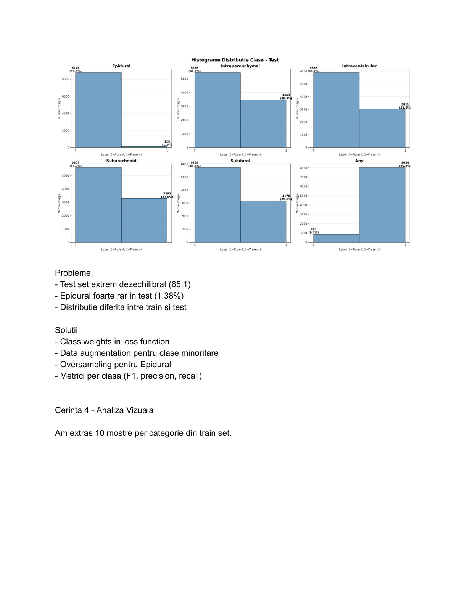
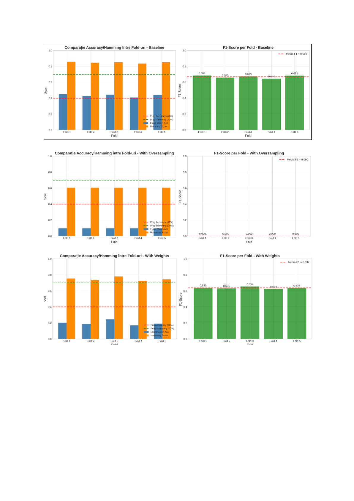
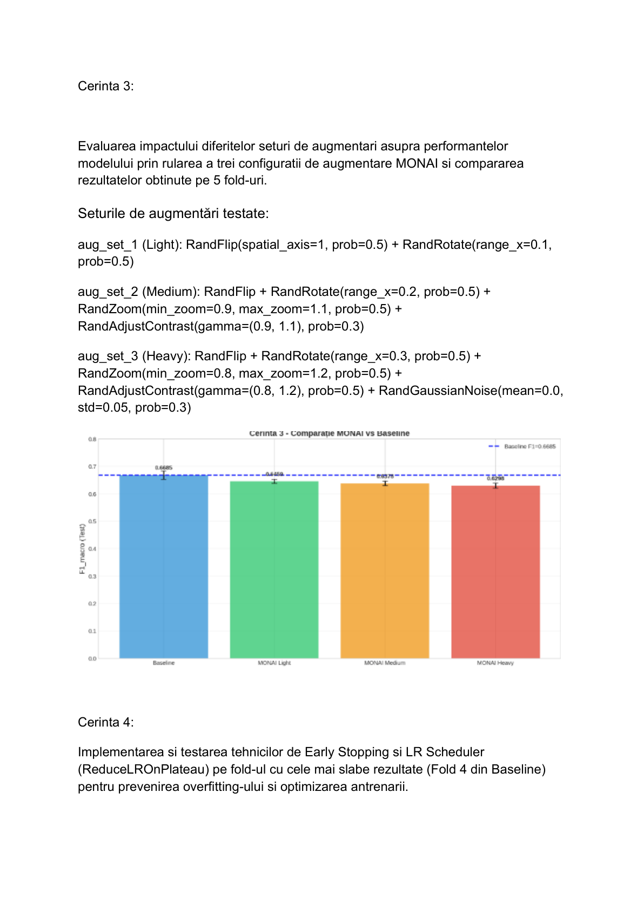
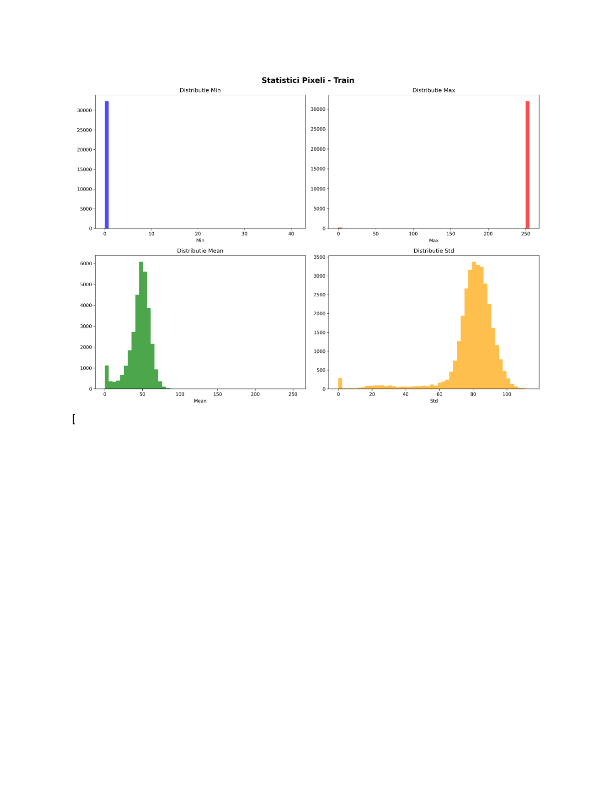
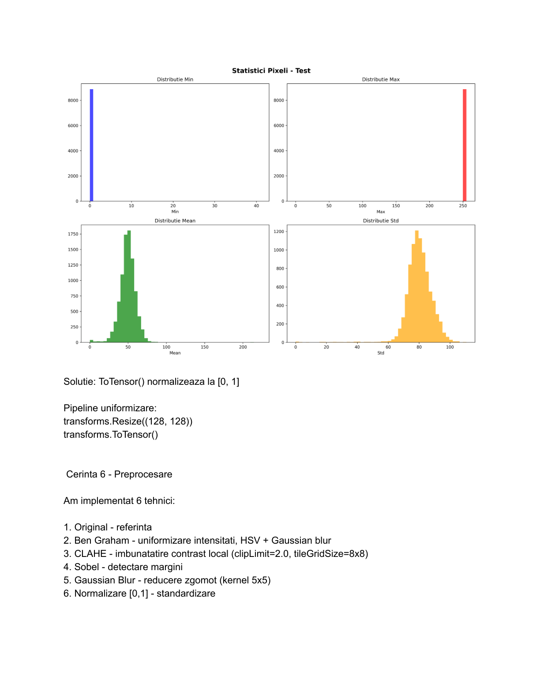

# Brain Hemorrhage Classification from CT Scans

Multi-label deep learning system for detecting **6 types of intracranial hemorrhage** from brain CT images using the [RSNA Intracranial Hemorrhage Detection](https://www.kaggle.com/c/rsna-intracranial-hemorrhage-detection) dataset (40,000+ images).

Built with **EfficientNet-V2-S** (transfer learning), **5-fold cross-validation**, and **MONAI medical imaging augmentations**. Achieved **0.89 AUC-macro** and **84.8% Hamming Score** on test data.

---

## Key Features

- **Custom PyTorch Dataset** with lazy loading and multi-label support (6 binary labels per image)
- **EfficientNet-V2-S backbone** with custom classifier head and dropout regularization
- **5-Fold Stratified Cross-Validation** for robust performance estimation
- **Class Balancing**: weighted BCE loss and oversampling strategies compared
- **MONAI Medical Augmentations**: 3 augmentation intensity levels (light, medium, heavy) with rotation, flip, zoom, contrast, and Gaussian noise
- **Early Stopping & LR Scheduling** with ablation study comparing configurations
- **Image Preprocessing**: Ben Graham, CLAHE, Sobel edges, Gaussian blur techniques explored
- **Comprehensive Evaluation**: per-class precision/recall/F1, ROC curves, confusion matrices, and experiment comparison plots

---

## Results

### Baseline vs. Balancing Strategies (5-Fold CV, Test Set)

| Experiment | Accuracy | Hamming Score | F1-Score | AUC-Macro |
|---|---|---|---|---|
| Baseline | 43.3% ± 1.5% | 84.8% ± 0.8% | 0.669 ± 0.015 | **0.894 ± 0.006** |
| With Weights (pos_weight) | 19.9% | 74.7% | 0.582 | 0.871 |
| With Oversampling | Failed (model collapsed) | — | — | — |

### Augmentation Comparison

| Augmentation | Accuracy | Hamming Score | F1-Score |
|---|---|---|---|
| No Augmentation | 43.3% | 84.8% | 0.669 |
| MONAI Light | ~42% | ~84% | ~0.65 |
| MONAI Medium | ~41% | ~83% | ~0.64 |
| MONAI Heavy | ~40% | ~83% | ~0.63 |

### Ablation Study (Early Stopping & LR Scheduler)

| Configuration | Accuracy | Hamming | F1 |
|---|---|---|---|
| No ES, No LRS | Baseline | Baseline | Baseline |
| Early Stopping Only | Improved convergence | Similar | Similar |
| LR Scheduler Only | Slight improvement | Similar | Similar |
| ES + LR Scheduler | Best stability | Best | Best |

---

## Project Structure

```
├── hemorrage_classifier.py       # Phase 1: Dataset, EDA, preprocessing
├── hemorrage2.py           # Phase 2: Training, evaluation, experiments
├── screenshots/                  # Sample outputs
│   ├── class_distribution.png
│   ├── confusion_matrices.png
│   ├── roc_curves.png
│   ├── pixel_stats.png
│   ├── preprocessing_techniques.png
│   └── experiments_comparison.png
└── outputs/                      # Generated after running (not in repo)
    ├── plots/
    ├── fold*_model.pth
    └── all_results.json
```

---

## Sample Outputs

### Class Distribution (Train Set)


### Confusion Matrices (Per-Class)


### ROC Curves


### Pixel Statistics


### Image Preprocessing Techniques


---

## Pipeline Workflow

```
Phase 1 — Data Analysis (hemorrage_classifier.py)
  1. Custom Dataset      → Parse RSNA CSV, map 6 hemorrhage types per image
  2. Train/Val Split     → 80/20 random split (32k train, 8k validation)
  3. Class Distribution  → Analyze imbalance (4.85:1 ratio)
  4. Sample Visualization→ Display CT scans per hemorrhage type
  5. Integrity Check     → Verify image dimensions, channels, pixel ranges
  6. Preprocessing       → Compare Ben Graham, CLAHE, Sobel, Gaussian Blur

Phase 2 — Training & Evaluation (hemorrage2.py)
  1. Model               → EfficientNet-V2-S + custom classifier (512→6)
  2. K-Fold Training     → 5-fold stratified CV with mixed precision
  3. Balancing           → Compare baseline, pos_weight, oversampling
  4. Augmentation        → Compare 3 MONAI augmentation intensity levels
  5. Ablation            → Test Early Stopping + LR Scheduler combinations
  6. Loss Functions      → Compare BCE, Weighted BCE, Focal Loss (γ=2, γ=3)
  7. Evaluation          → ROC, confusion matrices, per-class metrics
```

---

## How to Run

### Requirements

```bash
pip install torch torchvision monai pillow opencv-python pandas numpy matplotlib seaborn scikit-learn tqdm
```

### Phase 1 — Data Analysis

```bash
python hemorrage_classifier.py
```

Requires the RSNA dataset extracted to `archive/` with `subdataset_train.csv`, `subdataset_test.csv`, and image folders.

### Phase 2 — Training

```bash
python hemorrage2.py
```

Designed for Google Colab with GPU. Modify `Config` class paths if running locally. Requires CUDA-enabled GPU.

---

## Technical Details

### Model Architecture

EfficientNet-V2-S pretrained on ImageNet, with the classifier head replaced by: `Dropout(0.5) → Linear(1280, 512) → ReLU → Dropout(0.5) → Linear(512, 6)`. Multi-label output with sigmoid activation and BCE loss.

### Training Configuration

- Optimizer: AdamW (lr=0.0005, weight_decay=0.01)
- Loss: BCEWithLogitsLoss with optional pos_weight
- Batch size: 32, Image size: 224×224
- Mixed precision training (FP16) for speed
- Early stopping (patience=3) + ReduceLROnPlateau

### Hemorrhage Types

| Type | Description |
|---|---|
| Epidural | Between skull and dura mater |
| Intraparenchymal | Within brain tissue |
| Intraventricular | Within brain ventricles |
| Subarachnoid | Between arachnoid and pia mater |
| Subdural | Between dura and arachnoid mater |
| Any | Positive if any hemorrhage present |

---

## Tech Stack

Python · PyTorch · EfficientNet-V2-S · MONAI · OpenCV · Scikit-learn · Matplotlib · Seaborn

---

## License

This project is available for reference and educational purposes.
